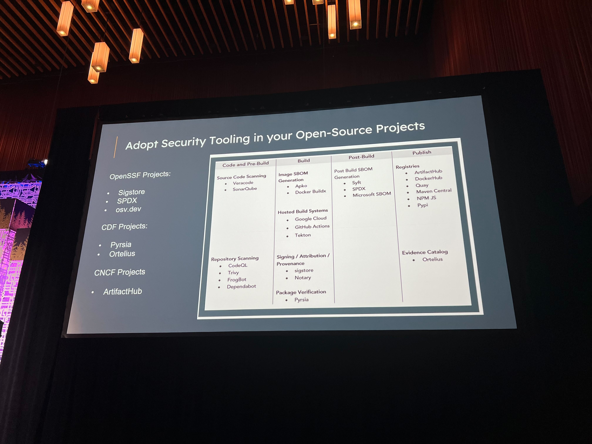
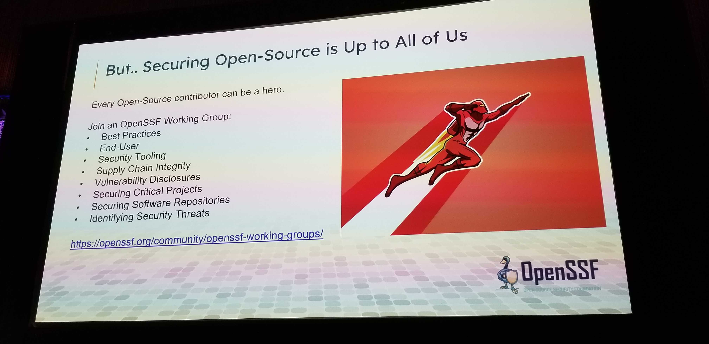
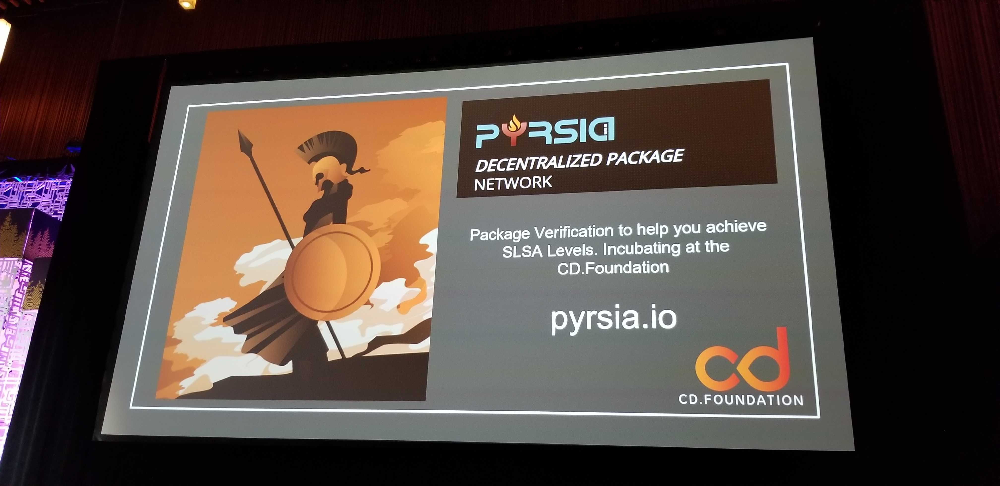
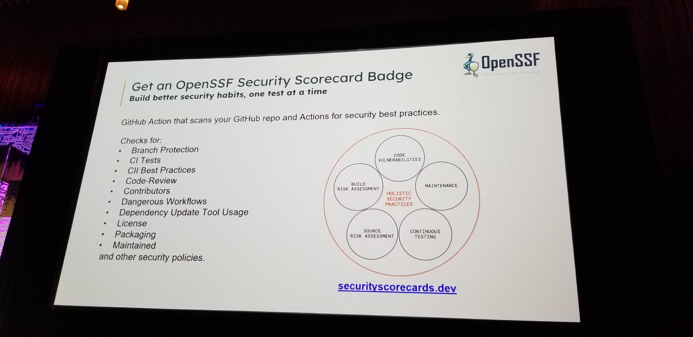
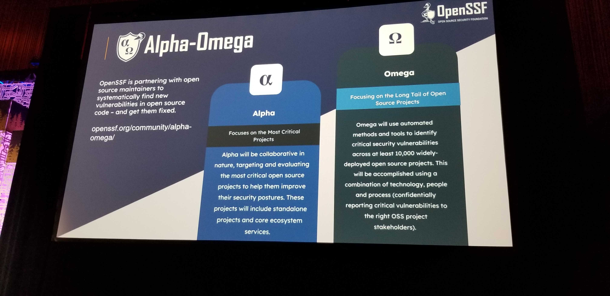
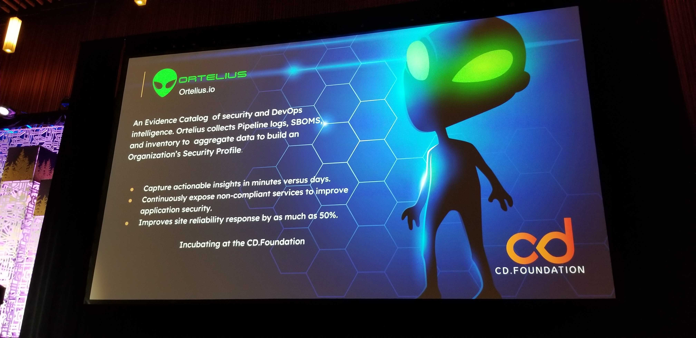

# Keynotes

## Jim Zemlin 

- SDPX 3.0 Spec 
- State of Tech Report: https://www.linuxfoundation.org/research/open-source-jobs-report-2023

## Dr. Angel Diaz: VP of Tech, Discover Financial

- A discover careers pitch

## Tracy Ragan - CEO & Co-founder of DeployHub

- Working Groups: https://openssf.org/community/openssf-working-groups

## Cory Doctorow - Science Fiction Author

Platform Decay - Insudification

2 concrete proposals to make it easier to abondon ship
- End to end principle
    - Intermediary delivers the feed from publisher to subscriber
- The right of exit
    - Give users the data need to establish themselves on another shop

## Eric Brewer - All aboard the automation train (Google Fellow)

Burdern of maintainance on maintainers. How about fixing the vulnerabilities.

A curator/consumer can buid and test something from source to 
- Ability for someone else to pay for build for things that they care about.

OSS-Fuzz
- Free fuzzing platform for 1000+ critical OSS projects
- Automated tests - A framework for automated builds and tests. Where a curator (not maintainer/collaborator) can automate the builds and tests.
.jpg)

## Mallory Knodel, Larry Kunz - More Diverse, Equitable, and Inclusive

:thumbs_down: