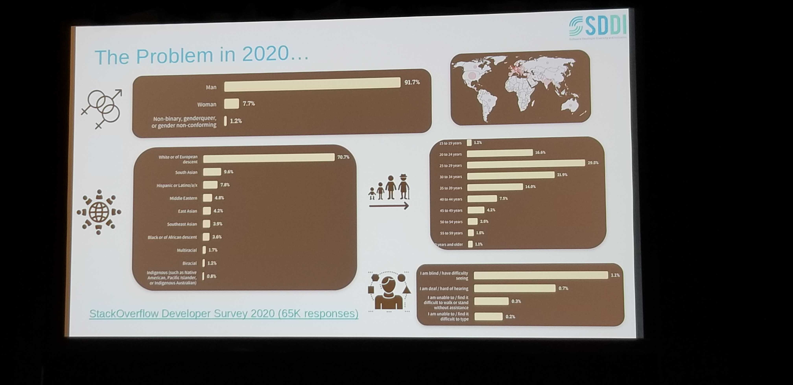
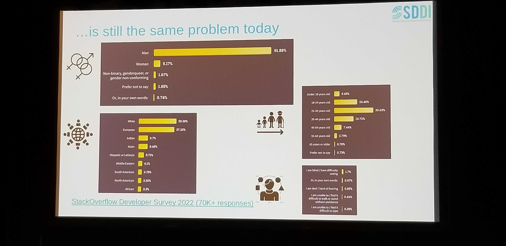
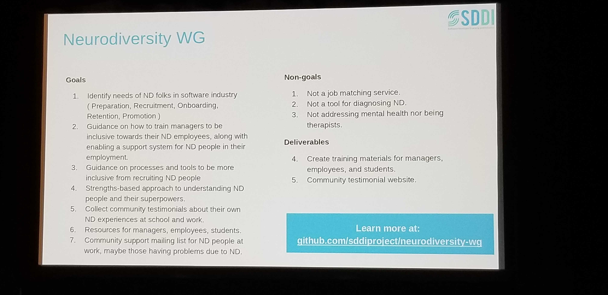
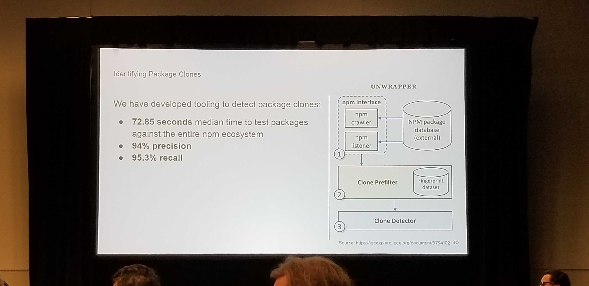
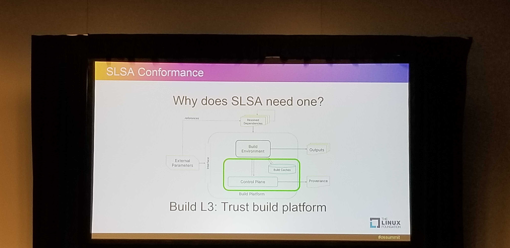

# OpenSSF day

Schedule -https://events.linuxfoundation.org/openssf-day-north-america/program/schedule/

## Opening Remarks - Brian Behlendorf

- [SLSA Level 1](https://slsa.dev/spec/v0.1/requirements) Requirements released
- SigStore signing for Cloud builds
- cdd guide (Also mentioned in the keynote)
- [S2C2F Framework] - For consuming OSS
- [2022 OpenSSF Report](https://openssf.org/wp-content/uploads/sites/132/2022/12/OpenSSF-Annual-Report-2022.pdf)
- [Alpha-Omega] - Finding and fixing Security vulnerabilities at scale. Fellow - [Jonathan Leitschuh](https://ossna2023.sched.com/speaker/jonathan.leitschuh)
- Introducing Omkar Arasaratnam - New GM (Chief of Staff) - 1.5M in grants over `22

## Government and OSS Community work together - Angana Rajan (ONCD - White House), Jack Cable (CISA)

`Angana Rajan`
- What is the White House paying attention to?
    - Memory Unsafe language (C/C++) - Introduces vulnerabilities by design
    - White House and ONCD (Cyber Security Policy) - Communicates to govenrnments that are focused on decentralized communities. 
    - Economics of Free S/w - Government focus on funding the community for ingrastructure that the government relies on
- What is the White House looking for from the community? What is the strategy
    - Shift incentives to rebalance security to the cyberspace to those who can most bear it. (Big Tech and Government)
    - Shift incentives to foster longer term solns rather than short term fixes

`Jack Cable`
- CISA role in enhancing security.
    - Cyber Sec & Infra Sec agency. Mission - Understand, manage and reduce risk to infra. Protecting the Federal and Civil use of infrasturcture software. 
    - Fed Gov is the largest consumer of OSS. Larger number of s/w developers in the gov.
    - Working on an internal strategy which will be released.
- CISA strategy to encourage security at scale:
    - https://www.cisa.gov/resources-tools/resources/secure-by-design-and-default
    - Shifting tone of liabilities to package managers

```
Parallel Track - Diversity and Inclusion
Lean In - Diversity and Inclusion - Cynthia Coupe
```
- The data: (2020)


- The data: (2023)


- [Neurodiversity Working Group](https://github.com/sddiproject/neurodiversity-wg)
    - Neuro-diverse (ADHD, Dsylxia) groups are 30% more productive than neuro-typical.
    
    - How do we support managers who can manage a neuro-divergent workforces. Can we support co-management?
    - Persons have spiked skills. (Very powerful in some areas vs lacking in other aspects)
    - Have access to their support systems - Mother/Wife.
    - [DEIA best practices WG](https://github.com/sddiproject/deia-best-practices-wg) 

## Alpha-Omega: Securing OSS through Direct Maintainer Engagement


-------------------------

## Looking at Context when Assessing Package Security (Elizabeth Wyss)

Slides: 
https://static.sched.com/hosted_files/openssfna2023/72/OpenSSF%20Day%20Lightning%20Talk%20--%20No%20Package%20is%20an%20Island.pdf



## SLSA Conformance - Kris Kooi (Google)
Supply-chain Levels for Software Artifacts

Slides: https://static.sched.com/hosted_files/openssfna2023/96/SLSA%20Conformance%20-%20OpenSSF%20Day.pdf

- Producer
- Source 
- Build : 
    
    - Provenance (Where a pkg came from and by whom)
    - Trusting the build system + An __auditor__
- Package 
- Consumer
                
## Fuzzing Rekor for Bugs and Vulnerabilities
No slides

Fuzzing - uses a Fuzz engine to produce pseudo random data and inject into a Fuzz harness.
- Possibly relevant in PCE, DMZ applications 

## Mobilization Plan (CROB)

Slides: https://static.sched.com/hosted_files/openssfna2023/4a/OSS-NA%202023%20-%20OSSFDay%20-%20Mobilizing%20for%20the%20Mobilization%20Plan%20%281%29.pptx.pdf