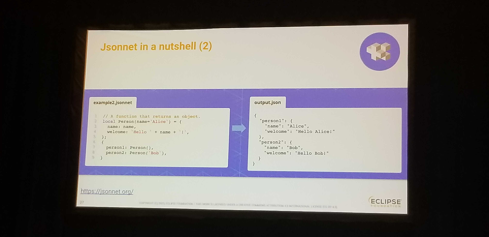

## Open SSC Security - Are containers the Biggest Blind Spot
Ayse Kaya (Slim.AI), Josh Bressers (Anchore), Liz Rice (Isolvalent), Lisa-Marie (CockroachDB)

### Is OSS more or less open to Secruity Attacks?

### What's the weakest link in SSC right now?

- Any unauthorized supply can be the weakest link. 
- Human's are the weakest link - Anything that can be automated, should. 

### What automation for anyone involved in the DevOps delivery should take to protect?

- Obervability for s/w ( Similar to Telemetry )
- No single category of container distros have fewer vulnerabilities than others.
- SBOMS have increased > 50%. Vulnerabilities are drowning with huger influx than the repair cycle.

### Future blackhole to protect s/w: Drawing parallels with Networking

- Why not turn on runtime firewalling for software access.
- Atleast let's start highlighting when resticted access is used within s/w (access to certain filesystems)
- OSS Security podcast (Josh Bressers)

### Runtime SBOMs

- Concerned with deployments that run on VMs and Bare metals and their exposure to risk.
- https://www.scmagazine.com/perspective/supply-chain/add-runtime-to-an-sbom-for-even-stronger-security%EF%BF%BC
- https://www.oxeye.io/resources/runtime-sbom-secure-microservices-with-runtime-visibility

### Runtime Observability

- A better description of developer intent.
- Ability to observe what's doing on to amke the policies

Public domain government project - https://ironbank.dso.mil/

## Fixing vulnerabilities at scale - Jonathan

Java ecosystem - Shut off the http access to artifact repositories
CodeQL scans 

Bulk PR generator

Http downlaod of dependencies - 1596 PR to fix this

Kinds of vulnerabilities you can fix with OpenRewrite
- Temporary directory vulnerabilities
    - Attacker races to to mkdir() and return the file handler to the application.
- Partial Path Traversal
    -   `users/sam` and `user/samantha/baz`
    - Java.getCanonicalPath("/user/sam/") returns '/user/sam'
    - Solved by Data Flow Analysis
- Zip Slip (A true Path Traversal Vulnerability)
    - Zip files are a KV piars 

## Configuration as Code - Mikael Barbero

OtterDog - Provides a view in document settings in Github. Once you view it, you can change and update it with minmal disruptions.

__Jsonnet__ is a superset of JSON - https://jsonnet.org/
- 
- Useful for generating large JSON files from a smaller set of functions.
- Let's you use Variables, conditionals, arthimetic, functions, imports, error propagation.

## Security Advisory Programs - Creating Transparency Along the S/w Supply Chain (Tyler Towes)

The personas dealing with enterprise SSC
- Vendors
- Security Compliance
- Developers

Why do we advisories? 
- If you're aware of an issue, and you don't tell anybody about it, you're not reducing your liability

Building a Program/Gathering support:
- S/w or Product team
    - Release least impact to them. Have them get back to work
- Customer Support
- Legal and Corporate communications
    - Shared goals w/ Security.
- Corporate communications (PR)
    - Control who gets to participate. Gather/incorporate that feedback

Coordinated Vuln Disclosure Policy
- A document that decribes your commitment to receive reports of vuln for 3rd parties
- Enable pulbic disclosures
- Shows maturity as a s/w vendor

Overview of Security Advisory Programs
- Coordianted Disclosure Advisory
    - DON'T not have a companion document. Help retain control of the messaging.
    - Also provide data on how customers can protect themselves.
- Security Maintenance Advisories (Patch,/Release Notes, Bulletin)
    - New patches releasing along with the advisories. 
    - Timing is key
- Incident Advisories (Just in Time)

Future of advisories?

Q) CVEs are lagging indicators, so how you communicate this to your customers
- There should be an easier way to assign CVEs. One can become a CNA, who can assign CVEs for a specific domain
- "Vulnergram"

Q) What happens to products where customers require and external validation to internal software
- PCOR team - Product security organization and response
    - Maybe a business requirement / agreement that you handle with your customers

## Code Genome - Fingerprinting Code to Build Trustworthy SBOMs
Slides: https://www.acsac.org/2022/program/ACSAC22-CodeGenome-Jang.pdf

Proposing a way to s/w fingerprints to gain assurance that code is what we think it is.

- Continuity across versions
- Different fingerprint for differences bw versions

Code Genome project released in 2023. Recently proposed in the OSS Maintainers Summit.

### How does it work? 
- Source -> Intermediate Representation -> Knowledge Graph

### Can you trust an SBOM?

- How do you verify the SBOM you get from the vendor is correct and complete?

### Reproducible builds:
- Ensuring the same source code results in the same binary for verification
- Same source code compiled in different env and setups generate the same gene.
