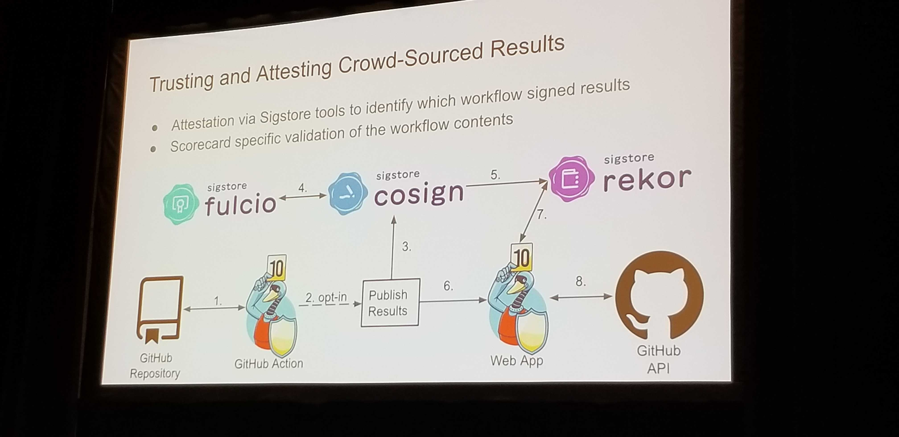

## How do we trust ScoreCard? 

### How scorecard is using remote attestations to scale?

### Using Github remote actions to get Sigstore attestations.

### Introducing Sigstore
Tool for generating security tools for OSS projects.
3 things
- Cosign (with keyless assigning) makes certificates 
- Fulcio - OIDC Authentication
- Rekor - Secure immuatable ledger for metadata
    - Provides transparency log

### Scorecard

