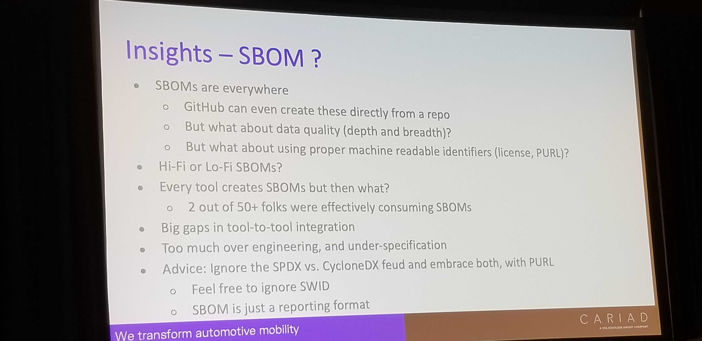

# OpenChain Micro conference

## OpenChain License & Security Compliance standard

OpenChain project provides guidance to support supply chain initiatives for small/medium/large device/hardware companies.

From their [website](https://www.openchainproject.org/community):
```
The majority of our community (and all our board members) are user companies of open source, but we have an extensive vendor partner program that can provide commercial support in our domain.
```


- It only works with SBOM (SDPX, CycloneDx, or SWIT)
- Has License Compliance and Security Standards

```
TIL - Standards for SBOM: SPDX, CycloneDX and SWIT
```

## State of Tooling in Open Source Automation

### Why open source compliance tooling?
- Necessity in industries which build their own software
- Compliance tooling creation and adoption

### Trends
- SBOMs exists. Can they be processed?
- License Compliance:
    - A lot of tools try. None knowingly succeeds.
- Open data and data sharing
    - Centralized or decentralized?

### Licensing
- Europe treats public domain licenses vastly more restrictively than North America.
    - I.e. in Europe authorship can't be renounced. You can allow it for _comercial exploitation_. But that still doesn't mean it's entirely the same as Public-domain license.
- So the same license could have different implications in different parts of the globe.

### SBOM


#### SBOM validation:
- Official ways of validating - Python and Java 
    - Is that jsonvalidate?
    - Do we know which one is community recommended? (SPDX)
- Also a validated SBOM doesn't necessarily mean its a correct SBOM

## [FOSSLight](https://fosslight.org)
FOSS and Light

Consist of Scanner, binaries, and Hub