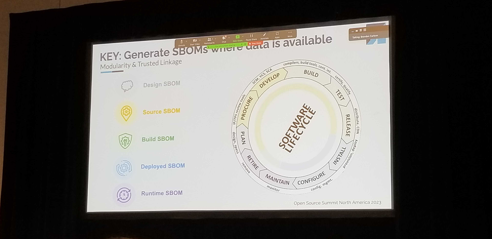
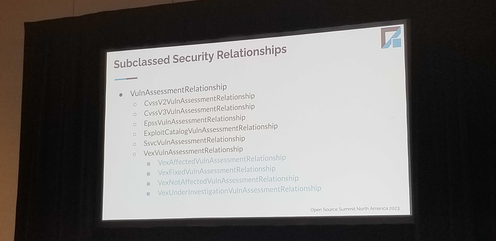
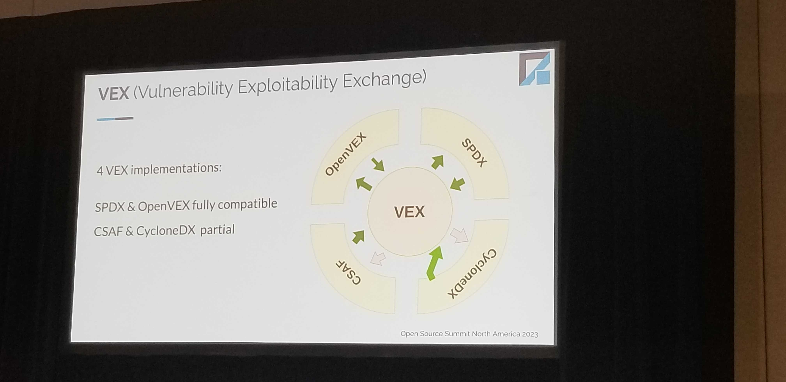
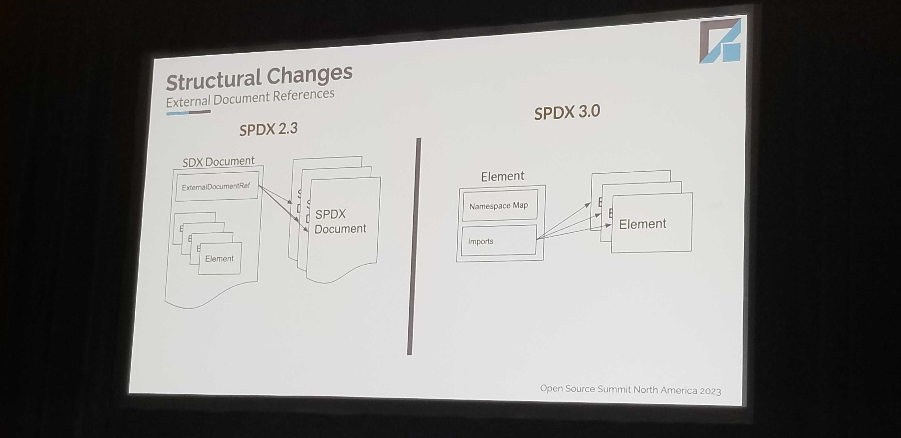
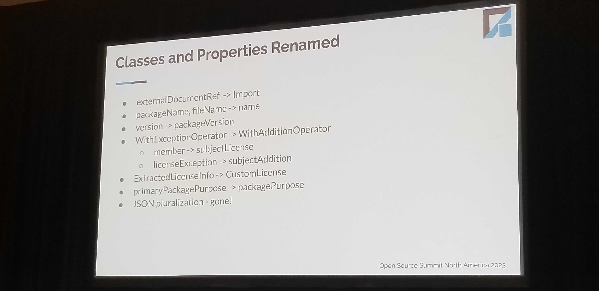

# SPDX 3.0

## Overview

Aims to cover usecases that go beyond Licenses. SPDX 3.0 - Released
- Oriented towards ppl using tools. (markdown w/ classes & properties)
- Comes with a python library


## Generate SBOMs where they can be trusted

Runtime -> Deploy -> Build -> Source -> 



### Spec Referencese: 

- License: 
https://github.com/spdx/spdx-3-model/tree/main/model/Licensing/Classes

## Multiple licenses in 1 file

- Some licenses apply to a snippet. And not all apply everywhere
- Scanning tools -> pick out 
    - `declaredLicense` 
    - `concludedLicense`
    - `distinctiveLicense`
- Need to support `modifiedLicense` (a benefit of SPDX)
    - GPL `WITH` __Something_else__

## Security Profile / Vulnerability Relationships

Note the VEX Relationship identifier
"VexVulnIdentifier"


## VEX Example

- Spec released in Jan `23
- 4 implemntations, currently


- VEX mechanism is not based around a s/w version. But around a product.
    - No tied to CVE, but defects in general
    - I.e. any Vuln that can be tracked and referenced.

```
VAQ: Can VEX expalaining SBOMs craete an impact story, through automation?
```

----------------
 ## Build Profile Use Cases

Revolves around 
- Security, 
- Reproducibility and 
- Auditing the quality/pedigree of the build (includes Provenance)
- Security

### YOCTO Exmaple - Nested Builds
Containing:
- Top Level build elements
- Secondary builds (a build child). Ensures incremental builds.

Build Profiles shine in representing build relationships in a build graph. This explores relationship types like `BUILD_OUTPUT_OF`, `BUILD_CHILD_OF`, `BUILD_INVOKED_BY`.


## SPDX 2.3 to SPDX 3.0 Comparison Overview (Gary )

Why the changes? 
- Additional Use Cases
    - AI and Data
    - Security
- Simplify
    - Profiles
    - Remove confusing names
- FLexiblity
    - Eg. in 2.3 you need an SBOM for every commit
    - IN 3.0 you only represent `ammended SBOMs` per commit and tie them all together

### Structural Changes
- Conformance Requirements
    - Addn'l restrictions on properties
- Namespace
    - Organizes vocabulary. (everything License related stays together)

#### External Document Reference


#### Relationships

#### Miscelleneous
- Entities, File Type, Package File Name, External Identifiers, PURL (top level property)

#### Names Changed


```
TIL: Tools convert CycloneDX SBOMs into SPDX3.0 SBOMs
```

```
Q: Is there support for self-attestation in the Build Profile?
```